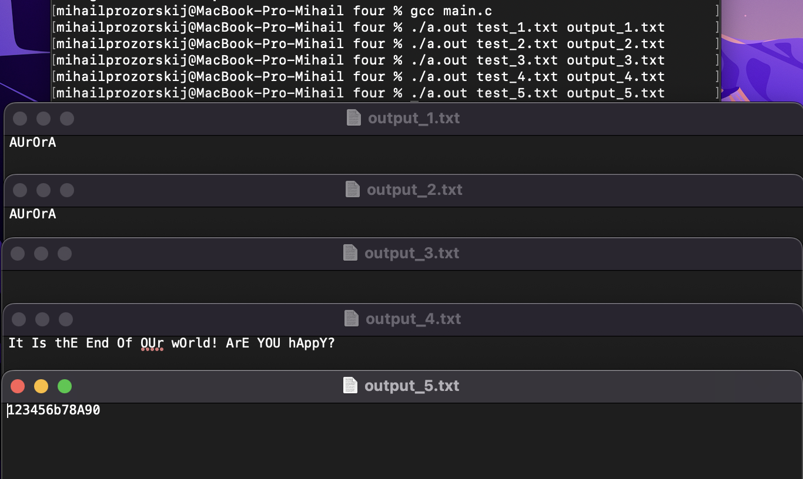
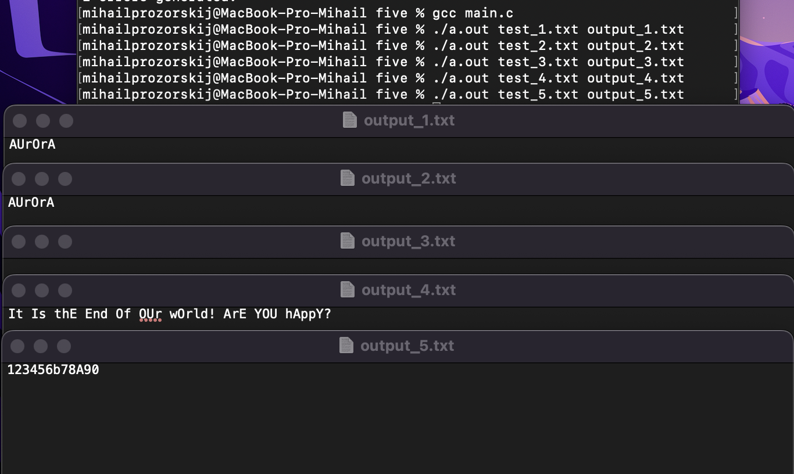
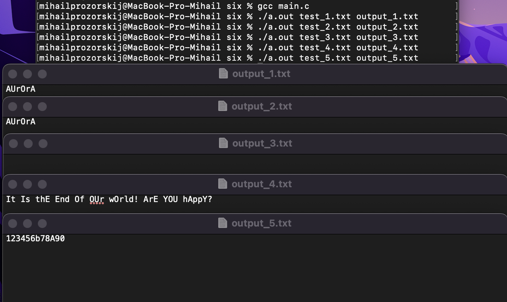
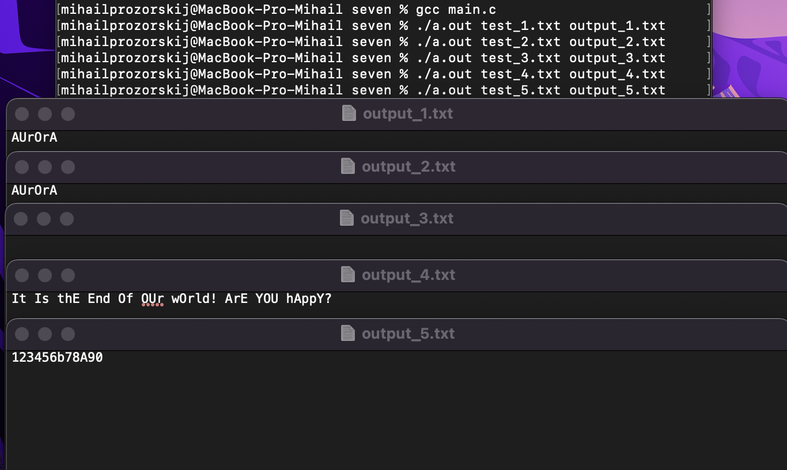

# ИДЗ №1
# Прозорский Михаил Алексеевич
# БПИ224
# Вариант 5

## Условие:
Разработать программу, заменяющую все строчные гласные буквы в заданной ASCII–строке заглавными.

## Решение
Были разработаны программы, которые в соответсвии с требованиями на определенную оценку заменяют все строчные гласные буквы английского алфавита(a,o,u,i,e,y) на заглавные.

### На 4 балла
Используются три процесса и два неименованных канала. Первый процесс считывает из исходного файла строку и передает ее по первому каналу второму процессу. Второй процесс меняет строку как описанно в пункте Решение и передает ее по второму каналу третьему процессу. Третий процесс записывает строку в итоговый файл

#### Тесты

### На 5 баллов
Используются три процесса и два именованных канала "one.fifo" и "two.fifo". Первый процесс считывает из исходного файла строку и передает ее по первому каналу второму процессу. Второй процесс меняет строку как описанно в пункте Решение и передает ее по второму каналу третьему процессу. Третий процесс записывает строку в итоговый файл

#### Тесты

### На 6 баллов
Используются два процесса и два неименованных канала. Первый процесс считывает из исходного файла строку и передает ее по первому каналу второму процессу. Второй процесс меняет строку как описанно в пункте Решение и передает ее по второму каналу первому процессу. Первый процесс записывает строку в итоговый файл

#### Тесты

### На 7 баллов
Используются два процесса и два именованных канала "one.fifo" и "two.fifo". Первый процесс считывает из исходного файла строку и передает ее по первому каналу второму процессу. Второй процесс меняет строку как описанно в пункте Решение и передает ее по второму каналу первому процессу. Первый процесс записывает строку в итоговый файл

#### Тесты

